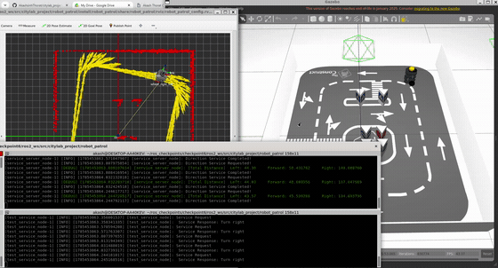
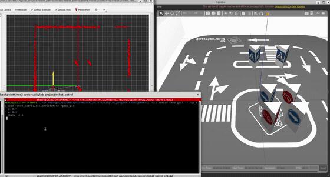
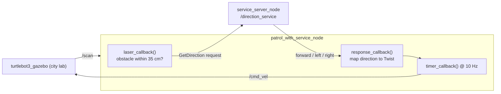

# robot_patrol: Patrol, Direction Service, and GoToPose Action for TurtleBot3 (ROS 2)

A **ROS 2 (Humble)** C++ package that drives a TurtleBot3 around The Construct's city lab, built up across three levels of ROS 2 communication: **topics** (a reactive laser patrol), **services** (a direction service that decides where to turn), and **actions** (a GoToPose server that drives the robot to a requested pose with live feedback).


> This package is my project for **Checkpoint 5 (Intro to ROS 2, Part 1)** and **Checkpoint 6 (Intro to ROS 2, Part 2)** of The Construct's ROS 2 Basics course. The `main` branch holds the simulation code; a `real-robot` branch holds the variant tuned for the physical TurtleBot3 in the Barcelona lab. The demos below are all from the simulation.

---

## Demos

### Checkpoint 5, Topics: reactive patrol

The TurtleBot3 patrolling the city lab. RViz (left) shows the laser scan and the odometry trail in the `odom` frame while Gazebo (right) shows the robot avoiding the walls and obstacles of the course.


The patrol node's debug stream next to RViz. Each line shows the nearest front obstacle, the safest angle it picked, and the resulting `cmd_vel`. The yellow odometry arrows trace a full lap around the arena.


### Checkpoint 6, Task 1: direction service

The service driven patrol. The `service_server_node` (top terminal) logs each request with the summed distance in the left, front, and right sectors and returns a decision, while the `test_service_node` (bottom terminal) prints the response. The robot patrols using those decisions.



### Checkpoint 6, Task 2: GoToPose action

The GoToPose action server drives the robot to a requested `[x, y, theta]` pose. The terminal streams the current pose as feedback once per second and ends with `Goal finished with status: SUCCEEDED`.



Full resolution videos: [patrol](assets/cp_5_patrol_demo.mp4), [patrol terminal](assets/cp_5_terminal.mp4), [direction service](assets/cp_6_task1_services.mp4), [GoToPose action](assets/cp_6_task2_action.mp4).

---

## Overview

This package is my implementation of the two **Introduction to ROS 2** checkpoints from The Construct's ROS 2 curriculum. The same robot and the same city lab are used throughout, and each checkpoint swaps in a more capable form of communication:

**Topics (Checkpoint 5).** A single `Patrol` node reads the laser scan and steers toward the most open ray in the front 180 degrees, driving forward until an obstacle appears within 35 cm. Sensing and actuation are split across a subscriber callback and a 10 Hz timer callback.

**Services (Checkpoint 6, Task 1).** The turn decision is moved out of the patrol node into a `/direction_service`. The service receives a laser scan, splits the front into three 60 degree sectors (right, front, left), sums the distances in each, and returns the direction of the most open sector. A `patrol_with_service` node calls the service and maps the response to a velocity command, and a small `test_service` client exercises the service on its own.

**Actions (Checkpoint 6, Task 2).** A `GoToPose` action server accepts a target pose `[x, y, theta]`, subscribes to `/odom` for the robot's current pose, and runs a two phase controller to reach the goal: first drive to the `(x, y)` waypoint, then rotate to the final heading. It publishes the current pose as feedback every second and returns a boolean result on success.

All of the custom interfaces (`GetDirection.srv` and `GoToPose.action`) are generated inside the `robot_patrol` package with `rosidl`.

---

## Nodes and interfaces

| Node (executable) | Type | Key interfaces |
| --- | --- | --- |
| `patrol_node` | Topics | subscribes `/scan`, publishes `/cmd_vel` |
| `service_server_node` | Service server | serves `/direction_service` (`GetDirection`) |
| `test_service_node` | Service client | subscribes `/scan`, calls `/direction_service` |
| `patrol_with_service_node` | Service client | subscribes `/scan`, calls `/direction_service`, publishes `/cmd_vel` |
| `action_server_node` | Action server | serves `/go_to_pose` (`GoToPose`), subscribes `/odom`, publishes `/cmd_vel` |

```
GetDirection.srv                 GoToPose.action
# Request                        # Goal
sensor_msgs/LaserScan laser_data geometry_msgs/Pose2D goal_pos
---                              ---
# Response                       # Result
string direction                 bool status
                                 ---
                                 # Feedback
                                 geometry_msgs/Pose2D current_pos
```

---

## How it works

### Direction service



The service sums the finite ranges in three 60 degree sectors and returns the most open one (`inf` returns are treated as the sensor's max range). The patrol node only calls the service once an obstacle is within 35 cm of the front, and maps the reply to a fixed command: forward is `linear.x = 0.1, angular.z = 0.0`, left is `angular.z = 0.5`, right is `angular.z = -0.5`. A single in flight flag keeps at most one request open at a time, and the 10 Hz timer is the only publisher to `/cmd_vel`.

### GoToPose action

```mermaid
flowchart LR
    Client["ros2 action send_goal"] -->|GoToPose goal_pos| AS
    Sim["turtlebot3_gazebo"] -->|/odom| AS
    subgraph AS["action_server_node (/go_to_pose)"]
      direction TB
      P1["Phase 1: drive to (x, y)\nP control on heading"]
      P2["Phase 2: align final theta"]
    end
    AS -->|/cmd_vel| Sim
    AS -->|feedback: current_pos @ 1 Hz| Client
```

The odometry callback converts the incoming quaternion to a yaw angle with `tf2`. Phase one drives forward at 0.2 m/s while a proportional controller points the robot at the waypoint (slowing the linear speed when the heading error is large), and stops within a 5 cm tolerance. Phase two rotates in place until the final heading is within about 0.05 rad. The goal executes on its own thread so the executor stays responsive, and cancellation is handled at every step.

---

## Repository structure

```
citylab_project/
└── robot_patrol/
    ├── CMakeLists.txt
    ├── package.xml
    ├── srv/
    │   └── GetDirection.srv               # service interface (Checkpoint 6)
    ├── action/
    │   └── GoToPose.action                # action interface (Checkpoint 6)
    ├── src/
    │   ├── patrol.cpp                      # topics patrol (Checkpoint 5)
    │   ├── direction_service.cpp          # /direction_service server
    │   ├── test_service.cpp               # service test client
    │   ├── patrol_with_service.cpp        # patrol driven by the service
    │   └── go_to_pose_action.cpp          # /go_to_pose action server
    ├── launch/
    │   ├── start_patrolling.launch.py     # patrol_node + RViz
    │   ├── start_direction_service.launch.py
    │   ├── start_test_service.launch.py
    │   ├── main.launch.py                 # direction service + patrol + RViz
    │   └── start_gotopose_action.launch.py
    └── rviz/
        └── robot_patrol_config.rviz       # odom frame, LaserScan, TF, Odometry trail
```

---

## Getting started

### Dependencies

- ROS 2 Humble on Ubuntu 22.04
- `rclcpp`, `rclcpp_action`, `sensor_msgs`, `geometry_msgs`, `nav_msgs`, `std_msgs`, `action_msgs`, `tf2`
- `rosidl_default_generators` (custom `srv` and `action` interfaces)
- The TurtleBot3 simulation (`turtlebot3_gazebo`) with the city lab world, and `rviz2`

### Build

```bash
cd ~/ros2_ws/src
git clone https://github.com/AkashsinhThorat/citylab_project.git
cd ~/ros2_ws
colcon build --packages-select robot_patrol
source install/setup.bash
```

### Run

Launch the simulation in one terminal:

```bash
export TURTLEBOT3_MODEL=waffle
source ~/simulation_ws/install/setup.bash
ros2 launch turtlebot3_gazebo main_turtlebot3_lab.launch.xml
```

Then, in another terminal sourced with `source ~/ros2_ws/install/setup.bash`:

```bash
# Checkpoint 5: topics patrol
ros2 launch robot_patrol start_patrolling.launch.py

# Checkpoint 6, Task 1: test the service, then the service driven patrol
ros2 launch robot_patrol start_direction_service.launch.py   # terminal A
ros2 launch robot_patrol start_test_service.launch.py        # terminal B
ros2 launch robot_patrol main.launch.py                      # service + patrol + RViz

# Checkpoint 6, Task 2: the action server, then send a goal
ros2 launch robot_patrol start_gotopose_action.launch.py
ros2 action send_goal -f /go_to_pose robot_patrol/action/GoToPose "goal_pos: {x: 0.7, y: 0.3, theta: 0.0}"
```

---

## Tech stack

- **Language:** C++ 17
- **Middleware:** ROS 2 Humble (topics, services, actions, custom `rosidl` interfaces, callback groups, multi threaded executors)
- **Libraries:** `rclcpp`, `rclcpp_action`, `tf2` (quaternion to Euler)
- **Simulation:** Gazebo Classic 11, TurtleBot3 (waffle) in The Construct city lab world
- **Visualization:** RViz2 with a saved config in the `odom` frame
- **Build:** colcon, ament_cmake
- **Platform:** Ubuntu 22.04 on WSL2 with WSLg for the Gazebo and RViz windows

---

## What I learned

Working through these two checkpoints took me from a single reactive node to the three core ROS 2 communication patterns, and each step had its own lesson:

- **Services turn a decision into a contract.** Moving the "which way do I turn" logic out of the patrol loop and behind `/direction_service` meant the patrol node no longer cared how the decision was made, only what came back. Designing the `GetDirection` interface first, then the server, then the client, made the boundary obvious and easy to test in isolation with the small `test_service` node.
- **Async service calls need back pressure.** Calling the service on every laser scan flooded it until I added a single in flight flag and only sent the next request after the previous reply arrived. Keeping the timer as the only publisher to `/cmd_vel` kept the command rate steady even while requests came and went.
- **Actions are the right tool for goals that take time.** The GoToPose server accepts a goal, streams feedback while it works, and reports a result at the end, which is a much better fit than a service for "drive over there." Running the goal on a detached thread and checking for cancellation each cycle is what keeps the server responsive to new goals.
- **Odometry is quaternions, control is angles.** The action controller only became stable once I converted the odometry quaternion to yaw with `tf2` and wrapped every angle error to `[-pi, pi]`. Splitting the motion into a drive phase and a final align phase kept the proportional control simple and the final pose within a few centimeters and a few degrees.

---

## Acknowledgements

Built as part of the **ROS 2 Basics in 5 Days (C++)** course by [The Construct](https://www.theconstruct.ai/). The TurtleBot3 packages are by [ROBOTIS](https://github.com/ROBOTIS-GIT/turtlebot3), and the city lab world is provided by the course.
