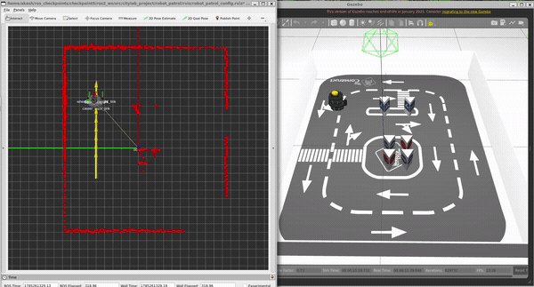
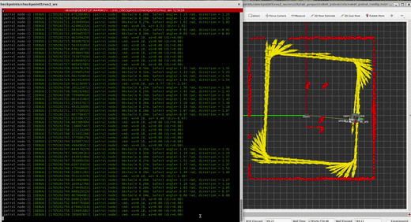
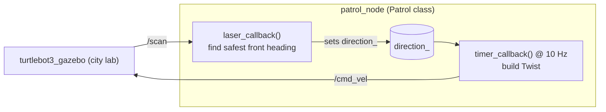

# robot_patrol: A Reactive Patrol Behavior for TurtleBot3 (ROS 2)

A **ROS 2 (Humble)** C++ package that gives a TurtleBot3 a reactive patrolling behavior. The robot drives continuously around The Construct's city lab, reads its laser scanner, and steers toward the most open direction in front of it so it keeps moving without hitting walls or obstacles.


> This is my project for **Checkpoint 5 (Introduction to ROS 2, Part 1)** of The Construct's ROS 2 Basics course. The `main` branch holds the simulation code; a `real-robot` branch holds the variant tuned for the physical TurtleBot3 in the Barcelona lab.

---

## Demo

The TurtleBot3 patrolling the city lab. RViz (left) shows the laser scan and the odometry trail in the `odom` frame while Gazebo (right) shows the robot avoiding the walls and obstacles of the course.



The patrol node's debug stream next to RViz. Each line shows the nearest front obstacle, the safest angle it picked, and the resulting `cmd_vel`. The yellow odometry arrows trace a full lap around the arena.



Full resolution videos: [patrol demo](assets/cp_5_patrol_demo.mp4), [terminal](assets/cp_5_terminal.mp4).

---

## Overview

This package is my implementation of the **Introduction to ROS 2 (Part 1)** checkpoint from The Construct's ROS 2 curriculum. The goal is a simple but complete patrol behavior: keep the robot moving around a bounded area indefinitely while avoiding whatever is in its way.

The behavior is deliberately reactive, with no map and no planner. It works from the laser scan alone:

- Drive forward at a constant **0.1 m/s**.
- Watch the **front 180 degrees** of the laser scan.
- When something in front comes closer than **35 cm**, look across those 180 degrees, find the ray with the **largest finite distance** (ignoring `inf`), and take its angle as the safest heading.
- That angle, clamped to the range **[-pi/2, +pi/2]** and stored in `direction_`, sets the turn rate: **angular.z = direction_ / 2**.

A clear separation between sensing and acting is central to the design. The **subscriber callback** only interprets the laser scan and updates `direction_`. A **separate 10 Hz timer callback** is the only place that publishes to `/cmd_vel`. The two run in their own callback groups under a multi threaded executor, so reading the sensor and commanding the wheels never block each other.

---

## How it works



The `laser_callback` measures the minimum finite distance in a narrow window straight ahead to decide whether an obstacle is blocking the path. If it is, `argmax_safest_index` scans the front 180 degree sector for the longest finite ray and converts that index back into an angle from the robot's X axis, clamped to plus or minus 90 degrees. If the path is clear, `direction_` is reset to zero and the robot goes straight.

The `timer_callback` fires every 100 ms and is the single writer to `/cmd_vel`: `linear.x` is always 0.1 m/s and `angular.z` is `direction_ / 2`. Because the timer is decoupled from the scan rate, the command stream stays at a steady 10 Hz regardless of laser timing.

The launch file also brings up **RViz2** with a saved configuration (fixed frame `odom`, plus RobotModel, TF, LaserScan as spheres, and an Odometry trail) so the whole behavior is visible while it runs.

---

## Repository structure

```
citylab_project/
└── robot_patrol/
    ├── CMakeLists.txt
    ├── package.xml
    ├── src/
    │   └── patrol.cpp                     # Patrol node: laser_callback + timer_callback
    ├── launch/
    │   └── start_patrolling.launch.py     # starts patrol_node + RViz2
    └── rviz/
        └── robot_patrol_config.rviz       # odom frame, LaserScan, TF, Odometry trail
```

The graded deliverable is `patrol_node`, built from `src/patrol.cpp`.

---

## Getting started

### Dependencies

- ROS 2 Humble on Ubuntu 22.04
- `rclcpp`, `sensor_msgs`, `geometry_msgs`, `nav_msgs`, `std_msgs`
- The TurtleBot3 simulation (`turtlebot3_gazebo`) with the city lab world, and `rviz2`

### Build

```bash
cd ~/ros2_ws/src
git clone https://github.com/AkashsinhThorat/citylab_project.git
cd ~/ros2_ws
colcon build --packages-select robot_patrol
source install/setup.bash
```

### Run

In one terminal, launch the simulation:

```bash
export TURTLEBOT3_MODEL=waffle
source ~/simulation_ws/install/setup.bash
ros2 launch turtlebot3_gazebo main_turtlebot3_lab.launch.xml
```

In a second terminal, start the patrol (this also opens RViz):

```bash
source ~/ros2_ws/install/setup.bash
ros2 launch robot_patrol start_patrolling.launch.py
```

The node exposes optional parameters for the scan and command topics and the loop period (`scan_topic`, `cmd_vel_topic`, `control_period_ms`), which made switching between the simulation and the real robot a matter of remapping rather than editing code.

---

## Tech stack

- **Language:** C++ 17 (single `Patrol` node, sensing and actuation split across two callbacks)
- **Middleware:** ROS 2 Humble (subscription with `SensorDataQoS`, publisher, wall timer, callback groups, multi threaded executor)
- **Simulation:** Gazebo Classic 11, TurtleBot3 (waffle) in The Construct city lab world
- **Visualization:** RViz2 with a saved config in the `odom` frame
- **Build:** colcon, ament_cmake
- **Platform:** Ubuntu 22.04 on WSL2 with WSLg for the Gazebo and RViz windows

---

## What I learned

This was my first full ROS 2 C++ node, and moving over from ROS 1 Noetic taught me most of the lessons here:

- **Separating sensing from acting makes the node predictable.** Keeping the laser callback as the only reader of the scan and the timer callback as the only writer of `/cmd_vel` meant the control rate stayed a clean 10 Hz no matter how the scan arrived. Putting each in its own callback group under a multi threaded executor is what makes that separation actually concurrent rather than just tidy on paper.
- **QoS is not optional in ROS 2.** The laser scan would not show up until I subscribed with `SensorDataQoS` (best effort) to match the publisher. That mismatch is invisible in ROS 1 and was my first real ROS 2 gotcha.
- **`inf` is a real value in a laser scan.** The "safest direction" is only meaningful if you skip the `inf` and `NaN` returns before taking the maximum, and then clamp the resulting angle to the front half plane. Getting that filtering right was the difference between smooth turns and the robot lunging at gaps behind it.
- **A reactive rule can go a surprisingly long way.** There is no map and no planner here, just "steer toward the most open ray in front," yet it completes clean laps of the arena in both directions. It also made the limits obvious, which is exactly what the next checkpoint sets out to improve.

---

## Acknowledgements

Built as part of the **ROS 2 Basics in 5 Days (C++)** course by [The Construct](https://www.theconstruct.ai/). The TurtleBot3 packages are by [ROBOTIS](https://github.com/ROBOTIS-GIT/turtlebot3), and the city lab world is provided by the course.
